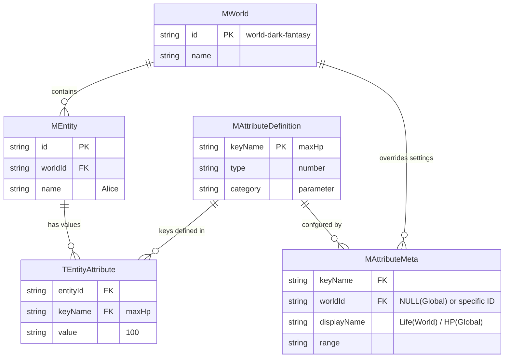

# Entity Key-Value データ移行仕様書

> [!NOTE]
> 本ドキュメントは、現行のEntityデータ（Persona/Parameter/State）をJSON形式からKey-Value形式へ移行するための仕様を定義します。

---

## 1. 基本方針

1.  **統合テーブル**: Persona/Parameter/Stateを `EntityAttribute` テーブル群に統合し、`category` カラムで分類します。
2.  **Key-Value形式**: 従来のJSONカラムをやめ、1プロパティ＝1レコードのKey-Value形式（縦持ち）に移行します。
3.  **定義とメタデータの分離**:
    *   `MAttributeDefinition`: 「どんなステータスが存在するか」（キー名、型、カテゴリ）を定義。
    *   `MAttributeMeta`: 「どう振る舞うか」（表示名、範囲制約、公開範囲）を定義。範囲（Range）などの制約はここで管理します。
4.  **ハイブリッドMeta**: グローバル定義＋ワールド固有オーバーライドの二層構造を採用します（Meta側で制御）。
5.  **定数管理**: `category`や`visibility`などの列挙値は`m_global_constants`で管理します。
6.  **View側分類**: UIでの表示時はCategoryでフィルタリングして、State/Parameter/Personaを出し分けます。

---

## 2. 定数管理 (m_global_constants)

### 2.1 概要

システム全体で使用される定数値（列挙型相当）は、すべて `m_global_constants` テーブルで一元管理します。
コード内でのハードコーディングを避け、データベースで定数を管理することで、拡張性と保守性を確保します。

### 2.2 使用する定数カテゴリ

| category | 説明 | 値の例 |
| :--- | :--- | :--- |
| `attribute_category` | 属性のカテゴリ | `persona`, `parameter`, `state` |
| `value_type` | 値の型 | `string`, `number`, `boolean`, `json` |
| `visibility` | 公開範囲タイプ | `public`, `private`, `conditional` |

### 2.3 Seedデータ例

```typescript
// prisma/seed.ts - 定数の投入
const globalConstants = [
  // === 属性カテゴリ ===
  { category: 'attribute_category', keyName: 'persona', keyValue: 'persona' },
  { category: 'attribute_category', keyName: 'parameter', keyValue: 'parameter' },
  { category: 'attribute_category', keyName: 'state', keyValue: 'state' },
  
  // === 値の型 ===
  { category: 'value_type', keyName: 'string', keyValue: 'string' },
  { category: 'value_type', keyName: 'number', keyValue: 'number' },
  { category: 'value_type', keyName: 'boolean', keyValue: 'boolean' },
  { category: 'value_type', keyName: 'json', keyValue: 'json' },
  
  // === 公開範囲 ===
  { category: 'visibility', keyName: 'public', keyValue: '常時公開' },
  { category: 'visibility', keyName: 'private', keyValue: '常時非公開' },
  { category: 'visibility', keyName: 'affection_threshold', keyValue: '好感度条件' },
  { category: 'visibility', keyName: 'event_unlocked', keyValue: 'イベント解放' },
  { category: 'visibility', keyName: 'skill_required', keyValue: 'スキル必要' },
];
```

---

## 3. ハイブリッドMetaテーブル設計

### 3.1 設計思想

「どんなステータスが存在するか」を定義する `MAttributeDefinition` と、
「そのステータスがどう振る舞うか（制約、表示など）」を管理する `MAttributeMeta` に分離します。



### 3.2 Prismaモデル定義

#### M_Attribute_Definition (定義マスタ)
ステータスの存在定義を行います。ここはワールドに依存しない普遍的な定義です。

```prisma
model MAttributeDefinition {
  keyName         String   @id @map("key_name") // IDとして使用
  category        String                     // m_global_constants.attribute_category
  valueType       String   @map("value_type") // m_global_constants.value_type
  description     String?  // 開発者向け説明

  metas           MAttributeMeta[]
  
  @@map("m_attribute_definitions")
}
```

#### M_Attribute_Meta (設定・制約マスタ)
表示設定や値の範囲制約などを管理します。ワールドごとのオーバーライドをここで吸収します。

```prisma
model MAttributeMeta {
  id              Int      @id @default(autoincrement())
  worldId         String?  @map("world_id")  // NULLならグローバル設定
  keyName         String   @map("key_name")
  
  // === 表示設定 ===
  displayName     String   @map("display_name")
  displayOrder    Int      @default(0) @map("display_order")
  
  // === 制約 (Constraints) ===
  // 単純なMin/Maxはカラムとして持つ（検索・バリデーション用）
  rangeMin        Float?   @map("range_min")
  rangeMax        Float?   @map("range_max")
  
  // === 公開範囲 ===
  visibility      String   @default("public")
  visibilityParam String?  @map("visibility_param")
  
  // === その他拡張 ===
  metadata        Json?    // Icon, Color, etc.
  
  createdAt       DateTime @default(now()) @map("created_at")
  updatedAt       DateTime @updatedAt @map("updated_at")

  // Relations
  definition      MAttributeDefinition @relation(fields: [keyName], references: [keyName], onDelete: Cascade)
  world           MWorld?  @relation(fields: [worldId], references: [id], onDelete: Cascade)

  @@unique([worldId, keyName])
  @@map("m_attribute_metas")
}
```

---

## 4. 統合EntityAttributeテーブル

### 4.1 設計概要

Persona/Parameter/Stateを物理的に分割せず、**1つのテーブル群（M/T/H）に統合**します。
データの分類は `category` カラムで行い、View表示時にフィルタリングします。

**メリット:**
- テーブル構造がシンプル
- 新しいカテゴリ追加時もスキーマ変更不要
- 横断検索が容易

### 4.2 Prismaモデル定義

#### M_Entity_Attribute（初期値マスタ）

```prisma
model MEntityAttribute {
  id          Int      @id @default(autoincrement())
  entityId    String   @map("entity_id")
  keyName     String   @map("key_name")
  keyValue    String   @map("key_value")
  createdAt   DateTime @default(now()) @map("created_at")

  entity      MEntity  @relation(fields: [entityId], references: [id], onDelete: Cascade)

  @@unique([entityId, keyName])
  @@map("m_entity_attributes")
}
```

> [!NOTE]
> **MAttributeDefinitionへの直接リレーションは設けない設計**
> 
> `MAttributeMeta`はハイブリッド構造のため、1対1/1対多のリレーションでは表現しきれません。`keyName`による論理的な関連としてViewでフォールバック付きJOINを行います。

#### T_Entity_Attribute（現在値トランザクション）

```prisma
model TEntityAttribute {
  id          Int      @id @default(autoincrement())
  entityId    String   @map("entity_id")
  keyName     String   @map("key_name")
  keyValue    String   @map("key_value")
  updatedAt   DateTime @updatedAt @map("updated_at")

  entity      MEntity  @relation(fields: [entityId], references: [id], onDelete: Cascade)

  @@unique([entityId, keyName])
  @@map("t_entity_attributes")
}
```

#### H_Entity_Attribute（変更履歴）

```prisma
model HEntityAttribute {
  id          Int      @id @default(autoincrement())
  entityId    String   @map("entity_id")
  keyName     String   @map("key_name")
  oldValue    String?  @map("old_value")
  newValue    String?  @map("new_value")
  changeType  String   @map("change_type") // 'update', 'create', 'delete'
  createdAt   DateTime @default(now()) @map("created_at")

  entity      MEntity  @relation(fields: [entityId], references: [id], onDelete: Cascade)

  @@map("h_entity_attributes")
}
```

---

## 5. 公開範囲（Visibility）の条件付き制御

### 5.1 公開範囲タイプ

| visibility | visibilityParam | 意味 |
| :--- | :--- | :--- |
| `public` | null | 常時公開 |
| `private` | null | 常時非公開（AI専用） |
| `affection_threshold` | `{"min": 50}` | 好感度が指定値以上で公開 |
| `event_unlocked` | `{"eventId": "secret_revealed"}` | イベントフラグで公開 |
| `skill_required` | `{"skill": "observation"}` | スキル所持で公開 |

### 5.2 公開判定ロジック

```typescript
function isAttributeVisible(
  definition: AttributeDefinition,
  playerContext: PlayerContext
): boolean {
  switch (definition.visibility) {
    case 'public':
      return true;
    case 'private':
      return false;
    case 'affection_threshold':
      const affParam = JSON.parse(definition.visibilityParam ?? '{}');
      return playerContext.affection >= (affParam.min ?? 0);
    case 'event_unlocked':
      const eventParam = JSON.parse(definition.visibilityParam ?? '{}');
      return playerContext.unlockedEvents.includes(eventParam.eventId);
    case 'skill_required':
      const skillParam = JSON.parse(definition.visibilityParam ?? '{}');
      return playerContext.skills.includes(skillParam.skill);
    default:
      return false;
  }
}
```

---

## 6. View側でのカテゴリ別表示

### 6.1 概要

統合テーブルからデータを取得し、**Metaテーブルの`category`でフィルタリング**して表示します。

### 6.2 実装例（Viewを使用）

Viewを使用することで、フォールバック処理をSQL側で完結させ、シンプルなクエリで属性を取得できます。

```typescript
/**
 * Entityの属性をカテゴリ別に取得（Viewを使用）
 */
async function getEntityAttributesByCategory(
  entityId: string,
  targetCategory: 'persona' | 'parameter' | 'state'
) {
  // Viewが定義解決とフォールバックを処理済み
  return await prisma.vEntityAttributeDetail.findMany({
    where: { 
      entityId,
      category: targetCategory
    },
    orderBy: { displayOrder: 'asc' }
  });
}

// 使用例
const stateAttributes = await getEntityAttributesByCategory(entityId, 'state');
const parameterAttributes = await getEntityAttributesByCategory(entityId, 'parameter');
```

> [!TIP]
> Viewを使用することで、`worldId`引数が不要になり、N+1クエリ問題も解消されます。

### 6.3 UIでの表示イメージ

```
┌─────────────────────────────────────┐
│ ステータス画面                       │
├─────────────────────────────────────┤
│ 【State】                            │
│   現在体力: 80                       │
│   現在地: 王都                       │
│   気分: 警戒中                       │
├─────────────────────────────────────┤
│ 【Parameter】                        │
│   最大体力: 100                      │
│   筋力: 50                           │
├─────────────────────────────────────┤
│ 【Persona】(好感度50以上で解放)      │
│   性格: 優しい                       │
└─────────────────────────────────────┘
```

---

## 7. 定義の解決ロジック（フォールバック）

```typescript
/**
 * 属性定義とメタデータを取得する
 */
async function getAttributeMeta(
  keyName: string, 
  worldId: string
): Promise<AttributeMeta | null> {
  // 1. まずワールド固有のメタを探す
  let meta = await prisma.mAttributeMeta.findUnique({
    where: { worldId_keyName: { worldId, keyName } }
  });
  
  // 2. なければグローバル設定にフォールバック
  if (!meta) {
    meta = await prisma.mAttributeMeta.findFirst({
      where: { worldId: null, keyName }
    });
  }
  
  return meta;
}
```

---

## 8. Entityモデルのリレーション変更

```prisma
model MEntity {
  id       String @id @default(uuid())
  worldId  String @map("world_id")
  type     String
  name     String
  description String?
  createdAt DateTime @default(now()) @map("created_at")
  updatedAt DateTime @updatedAt @map("updated_at")

  world    MWorld @relation(fields: [worldId], references: [id], onDelete: Cascade)
  chats    TChat[]

  // 統合リレーション
  initialAttributes  MEntityAttribute[]
  currentAttributes  TEntityAttribute[]
  historyAttributes  HEntityAttribute[]
  
  @@map("m_entities")
}
```

---

## 9. メタデータ拡張設計

### 9.1 拡張方針

| 項目の性質 | 格納場所 | 理由 |
| :--- | :--- | :--- |
| **必須・頻繁に検索** | 固定カラム | 型安全、インデックス可能 |
| **任意・ワールド依存** | `metadata` JSON | マイグレーション不要で柔軟 |

### 9.2 metadataカラムの使用例

```json
{
  "iconName": "heart",
  "colorCode": "#FF6B6B",
  "animationOnChange": "pulse",
  "minValue": 0,
  "maxValue": 1000
}
```

---

## 10. 移行手順

1. **定数投入**: `m_global_constants` にカテゴリ・公開範囲タイプを投入
2. **Schema更新**: 新テーブル定義を `schema.prisma` に追加
3. **Setup**: `prisma db push` でDB構造を反映
4. **Seed**: グローバル `MAttributeDefinition` を投入
5. **Migration**: 既存JSONデータを `t_entity_attributes` へ展開
6. **Switch**: アプリケーションの参照先を切り替え
7. **Cleanup**: 旧テーブル削除

---

## 11. 確認用View定義

### 11.1 概要

データ確認やデバッグを容易にするため、`t_entity_attributes`と`m_attribute_definitions`を結合したViewを定義します。
このViewは、ワールド固有定義 → グローバル定義のフォールバックロジックをSQL側で処理し、完全にハイドレートされた属性データを提供します。

### 11.2 SQL View定義

```sql
CREATE VIEW v_entity_attribute_details AS
SELECT
  tea.entity_id,
  tea.key_name,
  tea.key_value,
  me.world_id,
  
  -- Definition (Base)
  def.category,
  def.value_type,
  
  -- Meta (Resolved with Fallback: World > Global)
  COALESCE(world_meta.display_name, global_meta.display_name, tea.key_name) AS display_name,
  COALESCE(world_meta.display_order, global_meta.display_order, 0) AS display_order,
  COALESCE(world_meta.range_min, global_meta.range_min) AS range_min,
  COALESCE(world_meta.range_max, global_meta.range_max) AS range_max,
  COALESCE(world_meta.visibility, global_meta.visibility, 'public') AS visibility,
  COALESCE(world_meta.visibility_param, global_meta.visibility_param) AS visibility_param,
  
  tea.updated_at
FROM t_entity_attributes tea
INNER JOIN m_entities me ON tea.entity_id = me.id
INNER JOIN m_attribute_definitions def ON tea.key_name = def.key_name
LEFT JOIN m_attribute_metas world_meta
  ON tea.key_name = world_meta.key_name AND me.world_id = world_meta.world_id
LEFT JOIN m_attribute_metas global_meta
  ON tea.key_name = global_meta.key_name AND global_meta.world_id IS NULL;
```

### 11.3 Prisma View モデル

```prisma
view VEntityAttributeDetail {
  entityId        String   @map("entity_id")
  keyName         String   @map("key_name")
  keyValue        String   @map("key_value")
  worldId         String   @map("world_id")
  
  // From Definition
  category        String
  valueType       String   @map("value_type")
  
  // From Meta (Resolved)
  displayName     String   @map("display_name")
  displayOrder    Int      @map("display_order")
  rangeMin        Float?   @map("range_min")
  rangeMax        Float?   @map("range_max")
  visibility      String
  visibilityParam String?  @map("visibility_param")
  
  updatedAt       DateTime @map("updated_at")

  @@unique([entityId, keyName])
  @@map("v_entity_attribute_details")
}
```

### 11.4 使用例

```typescript
// カテゴリ別に属性を取得
const stateAttributes = await prisma.vEntityAttributeDetail.findMany({
  where: {
    entityId: 'some-entity-id',
    category: 'state'
  },
  orderBy: { displayOrder: 'asc' }
});

// バリデーション例（更新時）
if (attr.valueType === 'number' && attr.rangeMax !== null) {
  if (newValue > attr.rangeMax) {
    throw new Error('Value exceeds maximum');
  }
}
```

---

## 12. チェックリスト

- [ ] 統合テーブル構造（m/t/h_entity_attributes）の妥当性
- [ ] 定数管理（m_global_constants）への投入内容
- [ ] ハイブリッドMeta（グローバル+ワールド固有）の方針
- [ ] 公開範囲（visibility）の条件タイプ一覧
- [ ] View側でのカテゴリ別フィルタリング実装方針
