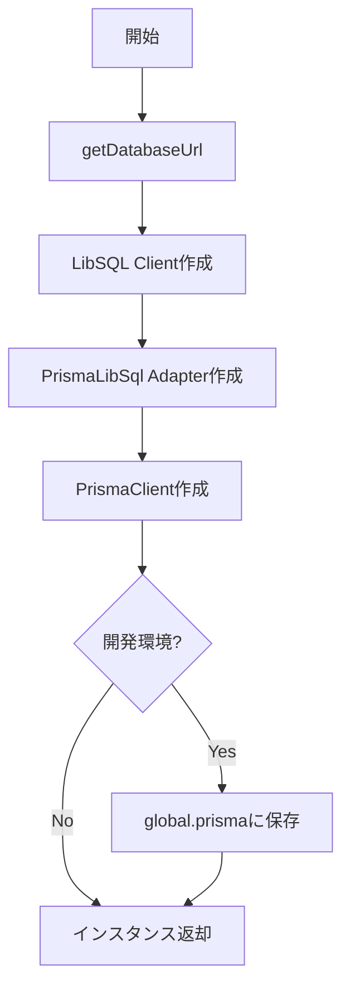

# Database (Prisma) 仕様書

## 概要

Prisma Clientのインスタンス管理モジュール。
LibSQLアダプタを使用してSQLiteに接続する。

---

## 基本情報

| 項目 | 内容 |
|:-----|:-----|
| **ファイルパス** | `main/infrastructure/database/prisma.ts` |
| **使用アダプタ** | `@prisma/adapter-libsql` |
| **DB種別** | SQLite (via LibSQL) |

---

## 特徴

- **シングルトン**: 開発環境でのホットリロード対策
- **エラーハンドリング**: 初期化失敗時も安全に処理
- **WASMベース**: better-sqlite3のネイティブ依存問題を回避

---

## 初期化フロー



---

## グローバル宣言

```typescript
declare global {
    var prisma: PrismaClient | undefined;
}
```

開発環境でのホットリロード時に複数インスタンスが作成されるのを防止。

---

## 使用方法

```typescript
import prisma from '../database/prisma';

// 使用例
const worlds = await prisma.mWorld.findMany();
```

> [!WARNING]
> ドメイン層やアプリケーション層から直接インポートしないこと。
> リポジトリ経由で使用すること。

---

## 関連ドキュメント

- [Config.md](./Config.md) - DATABASE_URL設定
- [Database_Specification.md](../Database_Specification.md) - スキーマ設計

---

## 変更履歴

| 日付 | 変更内容 |
|:-----|:---------|
| 2026-01-14 | 初版作成 |
