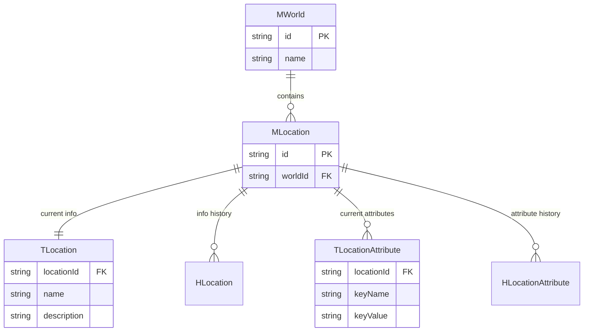

# Location System 仕様書

> [!NOTE]
> 本ドキュメントは、場所（Location）データを管理するためのデータベース設計仕様を定義します。
> Entityと同様に、Master/Transaction/Historyの3層構造と、Key-Value属性（Attribute）を採用します。

---

## 1. 基本方針

1.  **M/T/H 構成**:
    *   **Master (m_locations)**: IDの発行、Worldとの不変な紐付け。
    *   **Transaction (t_locations)**: 名前や説明など、可変だが基本的な情報の現在値。
    *   **History (h_locations)**: 基本情報の変更履歴。
2.  **Attributes (Key-Value)**:
    *   **T_Location_Attributes**: 場所ごとの動的な属性（天候、治安、環境汚染度など）をKey-Valueで管理。
    *   **H_Location_Attributes**: 属性値の変更履歴。
3.  **World リレーション**: 全ての Location は必ず一つの World に属します (`m_worlds.id` 参照)。

---

## 2. Prismaモデル定義

### 2.1 Location 基本テーブル (Base Tables)

#### M_Location (場所マスタ)
場所のアイデンティティを管理します。一度作成されたら不変の情報のみを持ちます。

```prisma
model MLocation {
  id        String   @id @default(uuid())
  worldId   String   @map("world_id")
  createdAt DateTime @default(now()) @map("created_at")

  // Relations
  world     MWorld   @relation(fields: [worldId], references: [id], onDelete: Cascade)
  
  current   TLocation?
  history   HLocation[]
  
  attributes         TLocationAttribute[]
  attributeHistory   HLocationAttribute[]

  @@map("m_locations")
}
```

#### T_Location (場所トランザクション - 基本情報)
場所の名前や説明など、変更される可能性のある基本情報の**現在値**を保持します。

```prisma
model TLocation {
  id          Int      @id @default(autoincrement())
  locationId  String   @unique @map("location_id")
  name        String
  description String?
  updatedAt   DateTime @updatedAt @map("updated_at")

  location    MLocation @relation(fields: [locationId], references: [id], onDelete: Cascade)

  @@map("t_locations")
}
```

#### H_Location (場所履歴 - 基本情報)
基本情報の変更ログを保持します。

```prisma
model HLocation {
  id          Int      @id @default(autoincrement())
  locationId  String   @map("location_id")
  name        String
  description String?
  changeType  String   @map("change_type") // 'create', 'update', 'delete'
  createdAt   DateTime @default(now()) @map("created_at")

  location    MLocation @relation(fields: [locationId], references: [id], onDelete: Cascade)

  @@map("h_locations")
}
```

### 2.2 Location 属性テーブル (Attribute Tables)

場所特有の状態（例: `weather`, `securityLevel`, `isLocked`）をKey-Value形式で管理します。
定義（Definition/Meta）については、既存の `MAttributeDefinition` / `MAttributeMeta` を拡張して利用することを想定しますが、必要であれば `location` カテゴリを追加します。

#### T_Location_Attribute (属性トランザクション)
属性の**現在値**を保持します。

```prisma
model TLocationAttribute {
  id          Int      @id @default(autoincrement())
  locationId  String   @map("location_id")
  keyName     String   @map("key_name")
  keyValue    String   @map("key_value")
  updatedAt   DateTime @updatedAt @map("updated_at")

  location    MLocation @relation(fields: [locationId], references: [id], onDelete: Cascade)

  @@unique([locationId, keyName])
  @@map("t_location_attributes")
}
```

#### H_Location_Attribute (属性履歴)
属性値の変更ログを保持します。

```prisma
model HLocationAttribute {
  id          Int      @id @default(autoincrement())
  locationId  String   @map("location_id")
  keyName     String   @map("key_name")
  oldValue    String?  @map("old_value")
  newValue    String?  @map("new_value")
  changeType  String   @map("change_type") // 'create', 'update', 'delete'
  createdAt   DateTime @default(now()) @map("created_at")

  location    MLocation @relation(fields: [locationId], references: [id], onDelete: Cascade)

  @@map("h_location_attributes")
}
```

---

## 3. ER図



---

## 4. 補足: Attribute Definition との連携

`EntityData_KeyValue_Migration.md` で定義された `MAttributeDefinition` および `MAttributeMeta` を Location にも適用する場合、Category に `location` を追加することで管理可能です。

*   **Category**: `location`
*   **KeyName例**: `pollution_level`, `population`, `weather`

これにより、場所のステータス定義もデータベース上で柔軟に管理・拡張が可能になります。
