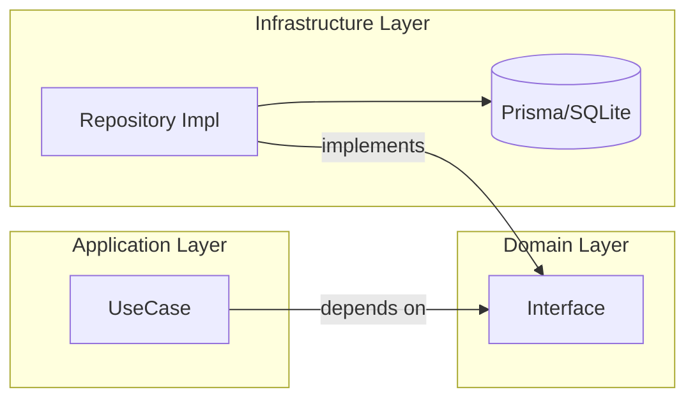

# リポジトリ仕様書インデックス

リポジトリはドメイン層で定義されるインターフェースと、インフラ層での実装に分離されています。

---

## インターフェース（ドメイン層）

| インターフェース | 対象エンティティ | 説明 |
|:-----------------|:-----------------|:-----|
| [IWorldRepository](./IWorldRepository.md) | World | ワールドのCRUD |
| [IEntityRepository](./IEntityRepository.md) | GameEntity | エンティティのCRUDとパラメータ更新 |
| [IChatRepository](./IChatRepository.md) | ChatMessage | チャット履歴の取得・保存 |
| [IApiLogRepository](./IApiLogRepository.md) | TApiLog | APIログの記録 |

---

## 実装（インフラ層）

| 実装クラス | 対応インターフェース |
|:-----------|:--------------------|
| PrismaWorldRepository | IWorldRepository |
| PrismaEntityRepository | IEntityRepository |
| PrismaChatRepository | IChatRepository |
| PrismaApiLogRepository | IApiLogRepository |
| PrismaUserProfileRepository | ※専用（インターフェース未定義） |

---

## アーキテクチャ原則

- UseCaseはインターフェースに依存し、実装には依存しない
- DIにより実行時に実装を注入

---

## 変更履歴

| 日付 | 変更内容 |
|:-----|:---------|
| 2026-01-14 | 初版作成 |
