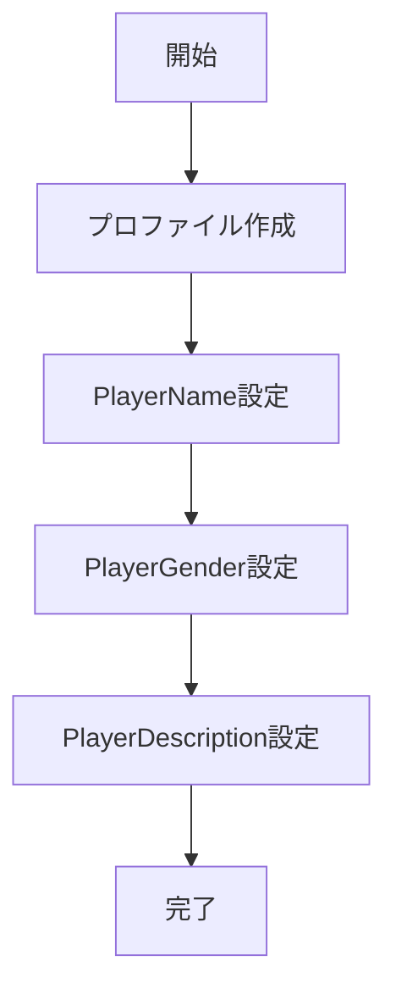

# CreateProfileUseCase 仕様書

## 概要

新しいユーザープロファイルを作成し、デフォルト設定を初期化するユースケース。

---

## 基本情報

| 項目 | 内容 |
|:-----|:-----|
| **ファイルパス** | `main/application/usecases/profile/CreateProfileUseCase.ts` |
| **カテゴリ** | Profile |
| **依存リポジトリ** | PrismaUserProfileRepository |
| **外部依存** | なし |

---

## 入力 (Input)

```typescript
type Input = string;  // プロファイル名
```

---

## 出力 (Output)

```typescript
type Output = void;
```

---

## 処理フロー



---

## デフォルト設定

プロファイル作成時に以下の設定が自動で追加される:

| キー | 初期値 | 型 |
|:-----|:-------|:---|
| `PlayerName` | プロファイル名 | string |
| `PlayerGender` | "" (空文字) | string |
| `PlayerDescription` | "" (空文字) | string |

---

## 関連ドキュメント

- [UserProfile_Spec.md](../UserProfile_Spec.md) - プロファイル機能仕様
- [DeleteProfileUseCase.md](./DeleteProfileUseCase.md) - プロファイル削除

---

## 変更履歴

| 日付 | 変更内容 |
|:-----|:---------|
| 2026-01-14 | 初版作成 |
