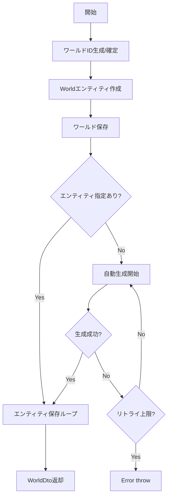

# CreateWorldUseCase 仕様書

## 概要

新しいワールドを作成し、エンティティ（NPC・プレイヤー）を生成・保存するユースケース。
エンティティが指定されていない場合は、AIによる自動生成を実行する。

---

## 基本情報

| 項目 | 内容 |
|:-----|:-----|
| **ファイルパス** | `main/application/usecases/world/CreateWorldUseCase.ts` |
| **カテゴリ** | World |
| **依存リポジトリ** | IWorldRepository, IEntityRepository |
| **外部依存** | LlmGateway, PromptTemplate |

---

## 入力 (Input)

```typescript
interface CreateWorldRequestDto {
    id?: string;         // ワールドID（省略時は自動生成）
    name: string;        // ワールド名
    prompt: string;      // ワールド説明
    entities?: {         // エンティティ配列（省略時は自動生成）
        id?: string;
        type: string;    // 'ENTITY_NPC' | 'ENTITY_PLAYER'
        name: string;
        description?: string;
        environment: Record<string, any>;
    }[];
}
```

---

## 出力 (Output)

```typescript
interface WorldDto {
    id: string;
    name: string;
    prompt: string;
    createdAt: string;   // ISO 8601形式
}
```

---

## 処理フロー



---

## 自動生成処理

### リトライ設定

| 項目 | 値 |
|:-----|:---|
| 最大リトライ回数 | 3 |
| リトライ間隔 | 1000ms |

### 生成内容

1. **NPC** - 名前、外見、性格、パラメータ等
2. **ロケーション** - 初期位置
3. **プレイヤー** - 基本ステータスと初期位置

### 生成プロンプト

- テンプレート: `prompts/world_gen_npc.md`
- 入力: ワールド名 + 説明文

### 生成データ構造

```typescript
{
    npc: {
        environment: {
            name: { val: string, category: 'basic', vis: string },
            // ... 他のパラメータ
        }
    },
    location: {
        name: string
    }
}
```

---

## 環境データの分割ロジック

入力された `environment` オブジェクトは以下のカテゴリに自動分類される:

### Personaカテゴリ

```
personality, role, tone, firstPerson, sentenceEnding,
name, description, race, gender, ageGroup, appearance, background
```

### Stateカテゴリ

```
location, locationId, locationName, condition,
affection, mood, weather
```

### Parameterカテゴリ

上記以外のすべてのキー

---

## エラーハンドリング

| エラー | 条件 |
|:-------|:-----|
| `Error("Failed to generate world characters after multiple attempts.")` | 自動生成が3回失敗 |

---

## 関連ドキュメント

- [GetWorldsUseCase.md](./GetWorldsUseCase.md) - ワールド一覧取得
- [NPC_Environment.md](../NPC_Environment.md) - NPC環境データ構造

---

## 変更履歴

| 日付 | 変更内容 |
|:-----|:---------|
| 2026-01-14 | 初版作成 |
