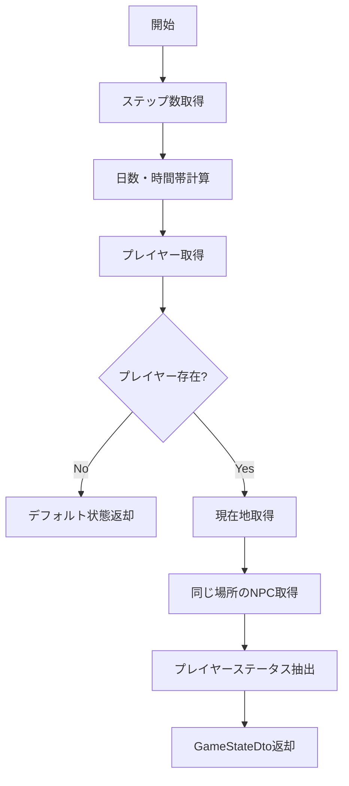

# GetGameStateUseCase 仕様書

## 概要

現在のゲーム状態（時間、場所、周囲のNPC、プレイヤーステータス）を取得するユースケース。
ステータス画面やチャット画面での情報表示に使用される。

---

## 基本情報

| 項目 | 内容 |
|:-----|:-----|
| **ファイルパス** | `main/application/usecases/game/GetGameStateUseCase.ts` |
| **カテゴリ** | Game |
| **依存リポジトリ** | IEntityRepository |
| **外部依存** | なし |

---

## 入力 (Input)

```typescript
type Input = string;  // worldId: ワールドID
```

---

## 出力 (Output)

```typescript
interface GameStateDto {
    totalSteps: number;      // 累計ステップ数
    day: number;             // 経過日数（1起算）
    timeOfDay: string;       // 時間帯（Early Morning/Morning/Afternoon/Evening）
    currentStep: number;     // 当日のステップ数
    locationName: string;    // 現在地名
    locationId: string;      // 現在地ID
    npcs: NpcInfoDto[];      // 周囲のNPC一覧
    playerStatus: {          // プレイヤーステータス
        name: string;
        level: number;
        job: string;
        hp: number;
        maxHp: number;
        mp: number;
        maxMp: number;
        condition: string;
    };
}

interface NpcInfoDto {
    id: string;
    name: string;
    role: string;
}
```

---

## 処理フロー



---

## 詳細処理

### 時間計算ロジック

| 定数 | 値 |
|:-----|:---|
| `STEPS_PER_DAY` | 100,000 |

```typescript
day = Math.floor(totalSteps / STEPS_PER_DAY) + 1;
currentStep = totalSteps % STEPS_PER_DAY;
```

### 時間帯判定

| ステップ範囲 | 時間帯 |
|:-------------|:-------|
| 0 - 19,999 | Early Morning |
| 20,000 - 49,999 | Morning |
| 50,000 - 74,999 | Afternoon |
| 75,000 - 99,999 | Evening |

### NPC取得

- プレイヤーの `locationId` と一致するNPCを検索
- 各NPCから `id`, `name`, `role` を抽出

---

## デフォルト値

プレイヤーが存在しない場合のデフォルト値:

| 項目 | デフォルト値 |
|:-----|:-------------|
| locationName | "Unknown" |
| locationId | "" |
| npcs | [] |
| playerStatus | デフォルトステータス |

---

## 関連ドキュメント

- [ProcessActionUseCase.md](./ProcessActionUseCase.md) - アクション処理（時間経過）

---

## 変更履歴

| 日付 | 変更内容 |
|:-----|:---------|
| 2026-01-14 | 初版作成 |
