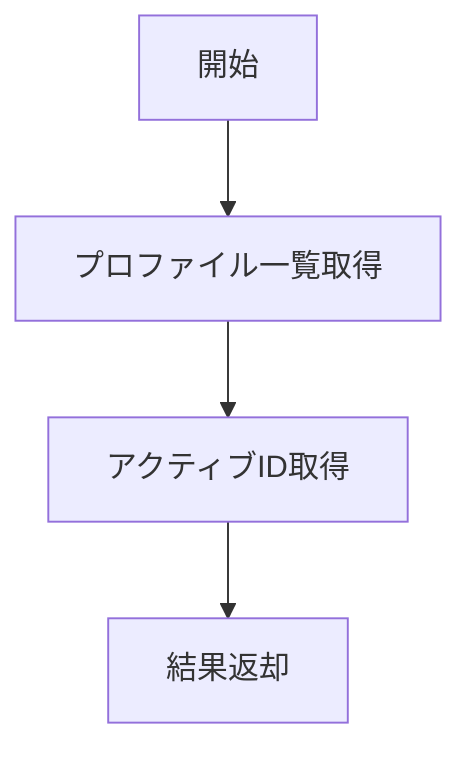

# GetProfileListUseCase 仕様書

## 概要

登録されているプロファイル一覧と現在のアクティブプロファイルを取得するユースケース。

---

## 基本情報

| 項目 | 内容 |
|:-----|:-----|
| **ファイルパス** | `main/application/usecases/profile/GetProfileListUseCase.ts` |
| **カテゴリ** | Profile |
| **依存リポジトリ** | PrismaUserProfileRepository |
| **外部依存** | なし |

---

## 入力 (Input)

なし

---

## 出力 (Output)

```typescript
interface Output {
    profiles: ProfileListItem[];
    activeId: number | null;
}

interface ProfileListItem {
    id: number;
    profileName: string;
    createdAt: Date;
    updatedAt: Date;
}
```

---

## 処理フロー



---

## 詳細処理

1. `getProfileList()` でプロファイル一覧を取得
2. `getGlobalSetting('sys.active_profile')` でアクティブIDを取得
3. アクティブIDが存在しない場合は `null` を返す

---

## 関連ドキュメント

- [SwitchProfileUseCase.md](./SwitchProfileUseCase.md) - プロファイル切替
- [CreateProfileUseCase.md](./CreateProfileUseCase.md) - プロファイル作成

---

## 変更履歴

| 日付 | 変更内容 |
|:-----|:---------|
| 2026-01-14 | 初版作成 |
