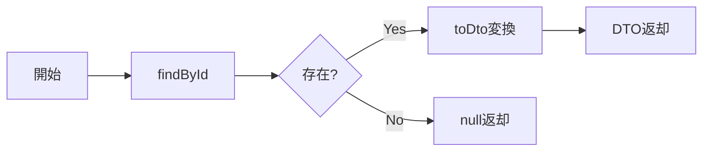

# GetWorldsUseCase 仕様書

## 概要

ワールド一覧の取得および特定ワールドの検索を行うユースケース。
ワールド選択画面での表示に使用される。

---

## 基本情報

| 項目 | 内容 |
|:-----|:-----|
| **ファイルパス** | `main/application/usecases/world/GetWorldsUseCase.ts` |
| **カテゴリ** | World |
| **依存リポジトリ** | IWorldRepository |
| **外部依存** | なし |

---

## メソッド一覧

### execute()

すべてのワールドを取得する。

#### 入力
なし

#### 出力
```typescript
type Output = WorldDto[];
```

---

### findById(id: string)

指定IDのワールドを取得する。

#### 入力
```typescript
type Input = string;  // ワールドID
```

#### 出力
```typescript
type Output = WorldDto | null;
```

---

## 出力DTO

```typescript
interface WorldDto {
    id: string;
    name: string;
    prompt: string;
    createdAt: string;  // ISO 8601形式
}
```

---

## 処理フロー

### execute()


### findById()



---

## 関連ドキュメント

- [CreateWorldUseCase.md](./CreateWorldUseCase.md) - ワールド作成

---

## 変更履歴

| 日付 | 変更内容 |
|:-----|:---------|
| 2026-01-14 | 初版作成 |
