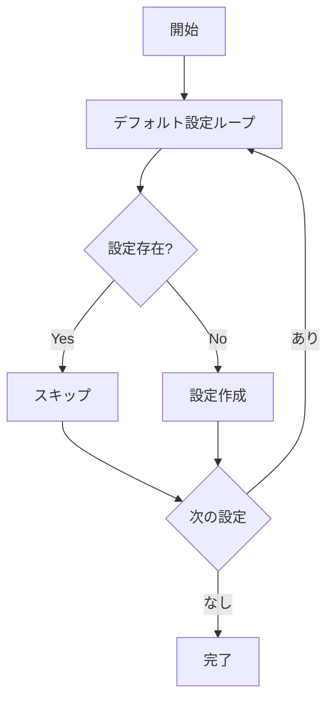

# InitializeGlobalSettingsUseCase 仕様書

## 概要

アプリケーション起動時にグローバル設定のデフォルト値を初期化するユースケース。
既存の値がある場合は上書きしない。

---

## 基本情報

| 項目 | 内容 |
|:-----|:-----|
| **ファイルパス** | `main/application/usecases/profile/InitializeGlobalSettingsUseCase.ts` |
| **カテゴリ** | Profile |
| **依存リポジトリ** | PrismaUserProfileRepository |
| **外部依存** | なし |

---

## 入力 (Input)

なし

---

## 出力 (Output)

```typescript
type Output = void;
```

---

## 処理フロー



---

## デフォルト設定一覧

### Primary LLM設定

| キー | デフォルト値 | 型 |
|:-----|:-------------|:---|
| `sys.llm.first.api_key` | "" | string |
| `sys.llm.first.api_endpoint` | "" | string |
| `sys.llm.first.model` | "" | string |
| `sys.llm.first.context` | "4096" | number |

### Secondary LLM設定

| キー | デフォルト値 | 型 |
|:-----|:-------------|:---|
| `sys.llm.second.api_key` | "" | string |
| `sys.llm.second.api_endpoint` | "" | string |
| `sys.llm.second.model` | "" | string |
| `sys.llm.second.context` | "4096" | number |

---

## 呼び出しタイミング

- アプリケーション起動時（`background.ts`）

---

## 関連ドキュメント

- [GetGlobalSettingsUseCase.md](./GetGlobalSettingsUseCase.md) - グローバル設定取得
- [UpdateGlobalSettingUseCase.md](./UpdateGlobalSettingUseCase.md) - グローバル設定更新

---

## 変更履歴

| 日付 | 変更内容 |
|:-----|:---------|
| 2026-01-14 | 初版作成 |
