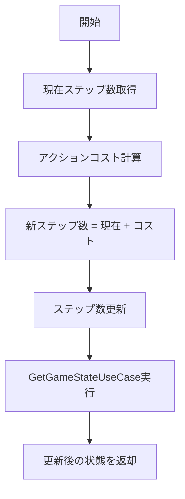

# ProcessActionUseCase 仕様書

## 概要

プレイヤーのアクション（会話、行動、スキップ）に応じてゲーム内時間を進めるユースケース。
アクションの種類によって消費するステップ数が異なる。

---

## 基本情報

| 項目 | 内容 |
|:-----|:-----|
| **ファイルパス** | `main/application/usecases/game/ProcessActionUseCase.ts` |
| **カテゴリ** | Game |
| **依存リポジトリ** | IEntityRepository |
| **外部依存** | GetGameStateUseCase（内部で使用） |

---

## 入力 (Input)

```typescript
type ActionMode = 'TALK' | 'ACTION' | 'SKIP';

interface Input {
    worldId: string;    // ワールドID
    mode: ActionMode;   // アクションモード
}
```

---

## 出力 (Output)

```typescript
type Output = GameStateDto;  // 更新後のゲーム状態
```

---

## 処理フロー



---

## アクションコスト

| モード | コスト | 説明 |
|:-------|:-------|:-----|
| `TALK` | 1 | 会話（最小単位） |
| `ACTION` | 3 | 行動（移動、調査など） |
| `SKIP` | 可変 | 次の日まで時間経過 |

### SKIPコスト計算

```typescript
const currentDay = Math.floor(currentSteps / STEPS_PER_DAY);
const nextDayStart = (currentDay + 1) * STEPS_PER_DAY;
const cost = nextDayStart - currentSteps;
```

---

## 定数

| 定数名 | 値 | 説明 |
|:-------|:---|:-----|
| `STEPS_PER_DAY` | 100,000 | 1日あたりのステップ数 |

---

## 依存関係

本ユースケースは以下の関数を外部から注入する設計:

- `getSteps(worldId: string): Promise<number>` - ステップ数取得
- `setSteps(worldId: string, steps: number): Promise<void>` - ステップ数更新

---

## 関連ドキュメント

- [GetGameStateUseCase.md](./GetGameStateUseCase.md) - ゲーム状態取得

---

## 変更履歴

| 日付 | 変更内容 |
|:-----|:---------|
| 2026-01-14 | 初版作成 |
