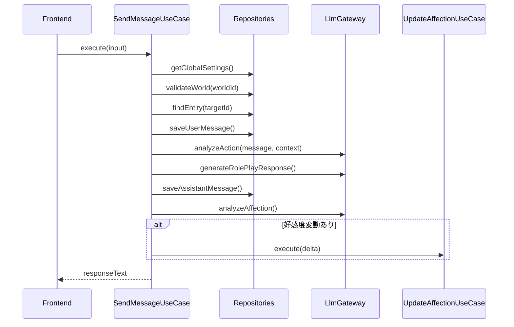

# SendMessageUseCase 仕様書

## 概要

プレイヤーがNPCにメッセージを送信し、AIによる応答を生成するユースケース。
チャット機能の中核を担い、メッセージの保存、アクション解析、応答生成、好感度更新を一連の流れで実行する。

---

## 基本情報

| 項目 | 内容 |
|:-----|:-----|
| **ファイルパス** | `main/application/usecases/chat/SendMessageUseCase.ts` |
| **カテゴリ** | Chat |
| **依存リポジトリ** | IChatRepository, IEntityRepository, IWorldRepository |
| **外部依存** | LlmGateway, PrismaUserProfileRepository |

---

## 入力 (Input)

```typescript
interface SendMessageInput {
    worldId: string;         // ワールドID
    message: string;         // プレイヤーのメッセージ
    targetId?: string;       // 対象NPCのID（必須）
    history?: {              // 会話履歴（オプショナル）
        role: string;
        content: string;
    }[];
}
```

---

## 出力 (Output)

```typescript
type Output = string;  // NPCの応答テキスト
```

---

## 処理フロー



---

## 詳細処理

### Phase 0: 設定取得とバリデーション

1. `t_user_settings` からLLM設定を取得
   - `sys.llm.first.api_key`
   - `sys.llm.first.api_endpoint`
   - `sys.llm.first.model`
2. 設定が不足している場合は `MissingConfigurationError` をスロー
3. アクティブプロファイルからプレイヤー情報を取得
   - `PlayerName`, `PlayerGender`, `PlayerDescription`

### Phase 1-2: ワールド・NPC検証

1. ワールドの存在確認
2. ターゲットNPCの存在確認
3. ユーザーメッセージをDBに保存

### Phase 3: アクション解析

- Sub Model を使用してプレイヤーの意図を解析
- コンテキスト情報を構築（時間、場所、対象NPC情報）

### Phase 4: 応答生成

- Main Model を使用してNPCの応答を生成
- 入力情報:
  - ワールド設定
  - プレイヤーメッセージ
  - NPC情報（全パラメータ）
  - 会話履歴
  - アクション解析結果
  - プレイヤープロファイル

### Phase 5: 応答保存

- NPCの応答を `t_chats` に保存
- `entityId` にNPCのIDを関連付け

### Phase 6: 好感度判定

- Sub Model で好感度変動を判定
- 変動がある場合は `UpdateAffectionUseCase` を呼び出し

---

## エラーハンドリング

| エラー | 条件 | 処理 |
|:-------|:-----|:-----|
| `MissingConfigurationError` | LLM設定未完了 | 設定ページへ誘導 |
| `Error("World not found")` | ワールド不存在 | エラーメッセージ表示 |
| `Error("Target NPC not found")` | NPC不存在 | エラーメッセージ表示 |
| `Error("Target NPC ID is required")` | targetId未指定 | エラーメッセージ表示 |

---

## 関連ドキュメント

- [Affection_System.md](../Affection_System.md) - 好感度システム仕様
- [UserProfile_Spec.md](../UserProfile_Spec.md) - プロファイル設定仕様

---

## 変更履歴

| 日付 | 変更内容 |
|:-----|:---------|
| 2026-01-14 | 初版作成 |
