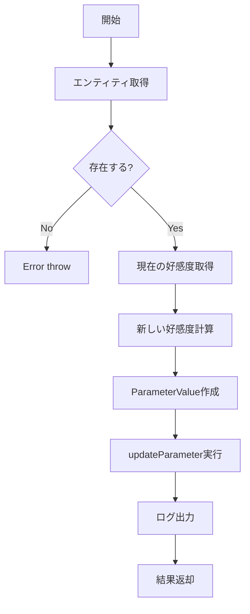

# UpdateAffectionUseCase 仕様書

## 概要

NPCの好感度を更新し、変更履歴を記録するユースケース。
AIによる好感度判定結果を受けて、エンティティのパラメータを更新する。

---

## 基本情報

| 項目 | 内容 |
|:-----|:-----|
| **ファイルパス** | `main/application/usecases/game/UpdateAffectionUseCase.ts` |
| **カテゴリ** | Game |
| **依存リポジトリ** | IEntityRepository |
| **外部依存** | なし |

---

## 入力 (Input)

```typescript
interface UpdateAffectionInput {
    entityId: string;    // 対象エンティティID
    delta: number;       // 変動値（正負）
    reason?: string;     // 変動理由（ログ用）
}
```

---

## 出力 (Output)

```typescript
interface UpdateAffectionResult {
    previousValue: number;   // 更新前の好感度
    newValue: number;        // 更新後の好感度
    entityId: string;        // エンティティID
}
```

---

## 処理フロー



---

## 詳細処理

### 好感度の格納先

| 項目 | 値 |
|:-----|:---|
| カテゴリ | `parameter` |
| キー名 | `affection` |
| 可視性 | `private`（非公開） |

> [!NOTE]
> 好感度は以前 `state` カテゴリに格納されていましたが、現在は `parameter` カテゴリに変更されています。

### 計算式

```typescript
newValue = currentAffection + delta;
```

### 履歴記録

`IEntityRepository.updateParameter()` は内部で履歴テーブル（`h_entity_parameters`）に変更を記録します。

---

## ログ出力

```
[UpdateAffection] {entityId}: {before} -> {after} ({reason})
```

---

## エラーハンドリング

| エラー | 条件 |
|:-------|:-----|
| `Error("Entity not found: {id}")` | 指定IDのエンティティが存在しない |

---

## 関連ドキュメント

- [Affection_System.md](../Affection_System.md) - 好感度システム全体仕様
- [SendMessageUseCase.md](./SendMessageUseCase.md) - 好感度判定の呼び出し元

---

## 変更履歴

| 日付 | 変更内容 |
|:-----|:---------|
| 2026-01-14 | 初版作成 |
