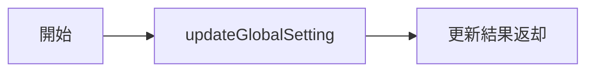

# UpdateGlobalSettingUseCase 仕様書

## 概要

グローバル設定を追加または更新するユースケース。

---

## 基本情報

| 項目 | 内容 |
|:-----|:-----|
| **ファイルパス** | `main/application/usecases/profile/UpdateGlobalSettingUseCase.ts` |
| **カテゴリ** | Profile |
| **依存リポジトリ** | PrismaUserProfileRepository |
| **外部依存** | なし |

---

## 入力 (Input)

```typescript
interface Input {
    key: string;     // 設定キー
    value: string;   // 設定値
    type: string;    // 値の型 ('string' | 'number' | 'boolean')
}
```

---

## 出力 (Output)

```typescript
type Output = GlobalSetting;
```

---

## 処理フロー



---

## 動作

- キーが存在しない場合: 新規作成（INSERT）
- キーが存在する場合: 更新（UPDATE）

---

## セキュリティ

APIキー（`*.api_key`）は `EncryptionService` により自動暗号化されて保存される。

---

## 関連ドキュメント

- [GetGlobalSettingsUseCase.md](./GetGlobalSettingsUseCase.md) - グローバル設定取得
- [UserProfile_Spec.md](../UserProfile_Spec.md) - セキュリティ詳細

---

## 変更履歴

| 日付 | 変更内容 |
|:-----|:---------|
| 2026-01-14 | 初版作成 |
